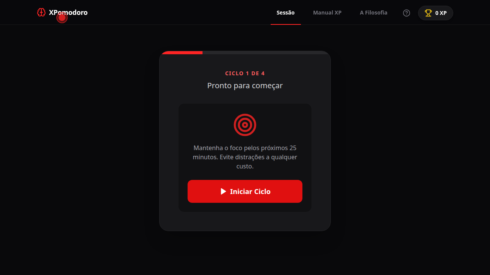
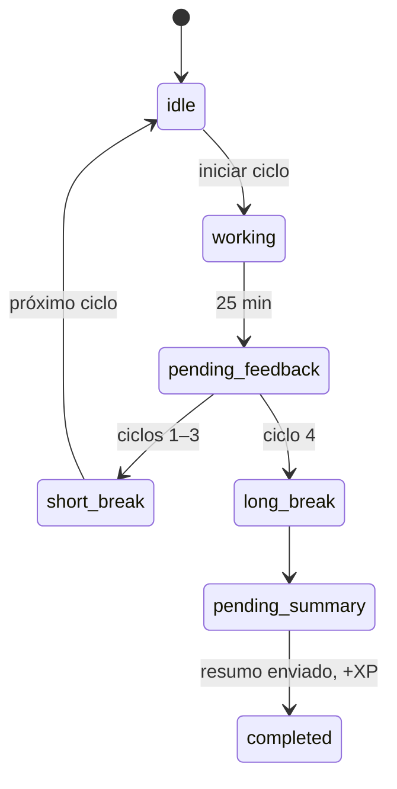

# XPomodoro

[](https://github.com/wenderu00/XPomodoro/actions/workflows/ci.yml)
[](LICENSE)


Timer pomodoro que aplica o ciclo curto de feedback do Extreme Programming ao trabalho
individual: a cada ciclo você registra como foi, e ao fim da sessão escreve uma
retrospectiva antes de descansar. Cada sessão concluída vale XP.

**[▶ Usar agora](https://wenderu00.github.io/XPomodoro/)**



## Como funciona

Uma sessão tem 4 ciclos de 25 minutos. Entre um ciclo e outro:

1. **Feedback do ciclo**: como foi a produtividade (a “avaliação constante” do XP).
2. **Pausa curta**; depois do 4º ciclo, **pausa longa** (ritmo sustentável, sem burnout).
3. **Resumo final**, depois da pausa longa: o que foi feito na sessão, como numa retrospectiva de sprint. Sem resumo, sem XP.



## Arquitetura

O código de sessão fica em `src/features/session/`, separado em camadas:

| Camada | O que tem |
|---|---|
| `domain/` | entidade `XPomodoroSession`, value objects (`CycleFeedback`, `SessionSummary`, `UserStats`) e a porta `ISessionRepository` |
| `usecases/` | um caso de uso por transição (`StartWork`, `CompleteWork`, `SubmitFeedback`, `CompleteBreak`, `SubmitFinalSummary`…) |
| `adapters/` | `LocalStorageSessionRepository`, a implementação da porta |
| `ui/` | componentes por fase, hooks e um contexto React que injeta os casos de uso |

A UI só conversa com os casos de uso, e os casos de uso só conhecem a porta. Trocar o
`localStorage` por uma API é escrever outro adapter.

## Rodando localmente

```bash
npm install
npm run dev      # http://localhost:5173
npm run build    # typecheck + build de produção
```

## Stack

React 18 · TypeScript · Vite · Tailwind CSS · React Router · React Joyride (tour de onboarding) · GitHub Pages

## Próximos passos

- Testes dos casos de uso e da entidade.
- Levar as regras de transição (e a dos 4 ciclos) para dentro da entidade.
- Persistir o cronômetro, para recarregar a página no meio de um ciclo não perder o estado.

## Licença

[MIT](LICENSE)
